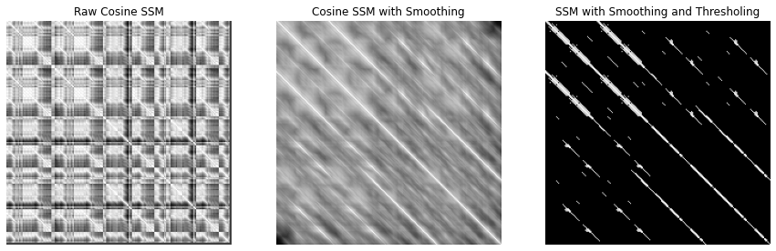
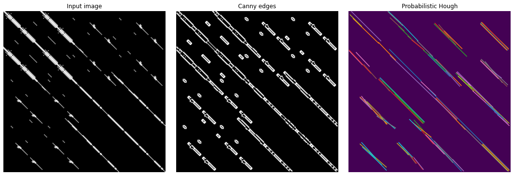

# Music-Structure-Segmentation
A repository for Symbolic Music Structural Analysis for the task of Boundary Detection of Structural Sections in String Quartet Sonatas.


## Overview
In this repository, we present a method for structural segmentation of symbolic scores. Our method consists of several descriptors which assign a probability to each bar for being a structural pivot point. We employ an HHM to model and learn underlying structure of music in particular to outline the Sonata form in Mozart String Quartets.

Introduction
============

In recent years, many efforts have been made to push further computational musical analysis and structure segmentation both on audio and symbolic music. Musical Structure Analysis (MSA) is a common practice in Western music specifically in branches such as Musical Morphology and analysis paradigms such as GTTM . Modern MSA tends to operate around three principals : repetition, novelty and homogeneity .

Some of the current trends in MSA involve self-similarity matrices on spectrograms for audio, Non-Negative Matrix Factorization and deep convolutional networks . The MSA task is often separated in two categories, the flat sequential segmentation and the hierarchical grouping. In the symbolic domain, a heavy interest towards hierarchical modelling of music has been present in recent research . Rhythmical formalization by recursive and hierarchical methods have been presented by the Algomus (Tree term re-writing) and DCML (Generative formal grammar) respectively.

For our approach, we inspire from the three principals of segmentation and we use methods influenced by hierarchical approaches, SSMs, computational musicology, and performance information. Music structure analysis is an ambiguous and sometimes subjective task which may give a lot of unfruitful paths towards its achievement, and thusly for our attempt we treat the MSA endeavour as a boundary detection task. Our aim is to ameliorate the descriptors used for symbolic music structural segmentation.

Our main purpose is to present a method for automating MSA which will then consist the framework for in-depth musical analysis based on GTTM and other variants of similar classical music analysis paradigms. For that reason, we restrict our focus on classical music, mainly from the classical and early-romantic eras, with the scope of unveiling homogeneous structural characteristics in this type of music.

Analysis descriptors
====================

To this end, we present a list of musical analysis descriptors which inform about musical structure.

List of descriptors :

1.  [hssm] Harmony SSM using interval Vectors (with cosine Similarity)

2.  [ps] Performance metrics -\> metrics validated by TISMIR experiment.

3.  [nd] Note Density metrics:

    -   Vertical

    -   Horizontal

4.  [cad] Intervalic Vector Cadences.

5.  [pr] Piano Roll metrics - Register Uniformity

6.  [rh] Rhythmical metrics :

    -   Phrasing Patterns using Schoenberg Klavierstucke

    -   Interruption of repetiveness

7.  [ts] Score Meta-Data (key and time signatures)

The main difference and importance of our descriptors lies on their musicological influence and their encapsulation of information.

### [hssm] Harmony SSM

The Harmony SSM is based on audio approaches for harmonic and timbre analysis . Much like a audio approach we have a moving window with an overlapping factor and for each window we compute a transform. However, our transform is not based on Fourier analysis but rather on Interval Vectors which produce vectors of fixed size. An interval vector is a vector of natural numbers which summarize the intervals present in a set of pitch classes . The advantage of the Interval vectors in SSMs lies on their simplicity and transposition invariance.

To build the SSM, we use cosine similarity together with smoothing and thresholding. The small size of the interval vectors is ineffective when considering the typical check-board kernel . We use probabilistic Hough transform and canny edge detection to outline structural segments. We filter those produced segments based on repetition motivated by the principles of repetition and novelty. Each position of the SSM represents the degree of similarity between two bars and its diagonal always contain the highest degree of similarity. Bars that are repeated or transposed appear as perfect paths, i.e. diagonal lines.

Given a musical score \(S\), we apply the window analysis and we fix the overlap factor and the size of the windows relative to the time signature and the tempo annotation of the score. Let \(l\) be the window size for the analysis \(s\) be the step, i.e. \(s = l - l*\textrm{(overlap factor)}\). Let \(x_0 \in x\) be the note with the largest duration, then for the last played note (or the last note of the array \(x\)) we add \(dur(x_0)\), that accounts for the duration of the piece, or \(dur(x)\). Then, let \(N = \lfloor dur(x)/l + s \rfloor + 1\). Given a function \(f\), we write the analysis \(X\) of \(S\) : \[X = \sum_{i=0}^N f(w_i)\] where \(w_i\) is the \(i^{th}\) window such that \(w_i := {\{  n \in x \; ; \; i*s \leq onset(n) \geq i*(s+1) \}} \subsetneq x\) [1] Furthermore, let the superscript \(w^j_i\) denote a window size \(j\)-times the base size of windows, \(l\).

Let us set the function \(f(w_i^j)\) to be the interval vector, i.e. \(\textrm{Int\_Vec }(w_i^j)\) which outputs the interval vector of all notes in the window \(w_i^j\). Therefore, the analysis \(\mathcal{X}\) of \(S\) :

\[\mathcal{X} = \sum_{i=1}^N \sum_{j=1}^\nu \textrm{Int\_Vec}(w_i^j)\]

where \(\nu\) is a fixed number, usually the \(\textrm{Int\_Vec}\) codomain dimension. Now, let \(\mathcal{D}\) be some matrix decomposition of \(X\), the cosine Self-similarity matrix \(\mathcal{S}\) of \(\mathcal{D}\) is :

\[\mathcal{S} = \frac{\mathcal{D} \cdot \mathcal{D}}{ \| \mathcal{D} \|^2}\]

To the obtained cosine Similarity matrix \(\mathcal{S}\) we will apply path smoothing by forward and backward median filtering along the diagonal. Furthermore, we apply thresholding to eliminate smoothing artifacts. Finally we can apply probabilistic Hough Transform to find paths segments in \(\mathcal{S}\)( see figure [fig:ssm]).






### [ps] Performance metrics

Performance metrics are based on a similar windowing technique but instead of interval vectors we use the Performance codec produced by the basismixer tool together with reduction metrics on the analysis. These metrics have been verified in the TISMIR experiment. To our knowledge this is the first MSA of symbolic music that considers performance information.

In particular, given a match score we can extract the expressive curves of a performance and find its peaks. We compared the expressive curves of real performances of music in the phrase level vs randomized performances in a specific feature. From this comparison we learned a metric function used to distinguish a real performance from a randomized one. Based on the same principal, we can compare expressive curves of structural sections vs non-structure essential sections.

### [nd] Note Density

Note Density metrics focus on the number of voices of chords (vertical) and the number of different onsets (Horizontal) in a fixed length window. We practically measure the rate of change of these metrics using the moving window approach. In particular we formalize those density metrics:

\[\begin{gathered}
        vd(w_i) = \textrm{mean}\Big\{ card(C)  \; ; \; x \in C \implies x \in \big\{ y \; ; \; x \in w_i \; \land \\ 
          \left( \textrm{onset}(y)=\textrm{onset}(x) \vee \textrm{onset}(y) < \textrm{onset}(x) + \textrm{dur}(x) \right) \big\} \Big\} 
    \end{gathered}\]

hd(w<sub>i</sub>) = { x,y ; x, y w<sub>i</sub> onset(x) onset(y) } &&

where \(W_i\) is the \(i^{th}\) window, \(x, y\) denote notes and \(c\) denotes chords. These metrics are based on the assumption that endings of sections tend to contain more chords and less melody. We expect to recover this assumption during the learning stage.

### [cad] Dictionary of Interval Vectors

The Dictionary of Interval Vectors consists of typical classical cadences and their Interval Vectors. Cadences principally occur at the end of phrases and sections, therefore during the pre-processing stage we record their occurrence within a fixed length moving window. Furthermore, we require the lowest notes to represent the root of the chords depending on the cadence. Interval vectors work in a pitch class space and therefore pitch is irrelevant. In addition, tools like interval vectors are more prominent to underlying forceful harmonic progressions, i.e. progressions that have enough pitch variation to contain chord changes and avoid chord repetition.

### [pr] Piano-Roll metrics

Our piano roll metrics yield information relevant to register uniformity. We assume that changes in the register domain could entrain changes of structural sections. Our descriptor records large changes in the presence of notes in every register. For this descriptor, we treat the piano roll as a rectangular image with a scanning window of fixed size that counts the number of black pixels (presence of notes) and their changing rate as the window slides horizontally or vertically. We utilize binary sparse matrices to encode the information of the windows and to reduce computations. The changing rate of notes is the inverse of the changing rate of the matrix’s sparsity.

### [rh] Rhythm metrics

The Rhythm metrics include phrasing patterns and repetition interruption. For phrasing structures we detect repeating rhythmical structure completely de-correlated to pitch. Last but not least, we detect rhythmical events that are characterized by breaking the uniformity of a section such as the interruption of repetitive rhythms in any voice that consist of at least \(k\) consecutive notes.

In our attempt to understand how musical phrasing works we studies the 3 Piano Etudes Op.11 by Schoenberg. This is one of the first atonal pieces where the classical and romantic practice are still very present. A while after the composition of these etudes Schoenberg developed his serialism theory for atonal theory and thus a era of consistent strict compositional theories began, that is why the etudes Op.11 consists the perfect example pieces to study classical phrasing whilst decorrelated to pitch and melody in the classical sense. In figure [fig:schoenberg] we can see the analysis of the first measure of Schoenberg’s Op.11

 

To model rhythm we have to proceed with a flattening procedure for which we flatten rhythmically repeated notes. Therefore, a rhythm layer consists of all rhythm values in the score that have the same score onset and score duration. We, furthermore, add the exception of a note with a different duration intervening in between the pitch register of notes with the same onset and duration. In that case, we create not 2 but 3 rhythm layers. Let, \(r_1, \dots, r_n\) be rhythms of a layer \(x\) we code \(\phi(x)\) in a ternary fashion such that :

\[\begin{aligned}
        \phi(r_1) &= 0 \\
        \phi(r_m) &= 
            \begin{cases}
                 0  & \text{if } r_{m-1} = r_m \\
                 1  & \text{if } r_{m-1} < r_m \\
                -1 & \text{otherwise}
            \end{cases}
    \end{aligned}\]

We augment our vocabulary by a padding / empty character \(-\). We attempt to a constant length encoding by padding all layers with the \(-\) character. We use a generalized suffix tree to identify repeating patterns of size up to \(n\), where \(n\) can be an assumption or a hyper-parameter. Additionally, by construction we require the layers to be ordered in information quantity order.

It is a frequent phenomenon in classical music to build end of sections with a climactic repetitive sequence that ends with a cadence or a larger rhythmical value. In our effort to capture those compositional clichés, we search for interruption of repetitive rhythms which consist of at least \(k\) notes, where \(k\) be an assumption or a hyper-parameter.

### [ts] Score Meta-Data

From the homogeneity assumption on musical structure we can use some score information such as possible time-signature or key signature changes for structural boundary detection. In addition, if we are analysing multi-instrumental scores then we can benefit by the orchestration changes for our task.

Learning structure
==================

Let \(\mathcal{F}\) be a series of finite binary analysis per bar descriptors \({\{ f_1, \dots, f_k \}}\). For example, \(f_i(bar_j)=1\) if \(bar_j\) is the end of a section based on the \(i^{th}\) feature and \(0 \) if it isn’t.

HHMs to model structure
-----------------------

Inspired by the audio approach where audio frames are represented as states of a HMM , our first attempt is to use a HMM similar to that described in . This will be our baseline to test our descriptors with other approaches to the same dataset (32 Mozart String Quartet Sonatas).

A HHM \(\mathcal{X} = (Q_{fin}, \iota, \zeta, A, E)\) on \(\mathcal{F}\) is defined by a set of finite states \(Q\) corresponding to successive sections of a score \(S\). The probabilities of the initial and the final state are \(\iota, \zeta\) correspondingly. \(A\) of the transition probability and \(E\) is the emission probability. The probability that state \(q_i \in Q_{fin}\) outputs a subset \(x \subseteq \mathcal{F}\) is :


```
 = \prod_{f \in x} E(i, f) \cdot \prod_{f' \in \mathcal{F}\setminus x} \left( 1 - E \left( i, f' \right) \right))
```

We can use the viterbi algorithm to maximize the probability of a path that goes through a subset of states while outputting a sequence of subsets of \(\mathcal{F}\).

The section annotations can be used to learn the parameters of the HMM using any EM algorithm such as the Baum–Welch algorithm. HMM on MSA suggest to use Pseudo counts to prevent zero emission and transition probabilities.

I represent it here as simple HHM now but I plan to formulate it more elegantly to completely fit my descriptors and my assumptions.

Convolutional Techniques
------------------------

Let \(k\) be the number of songs in our data-set and \((\theta_i)_{0<i<k}\) be the number of bars for each song. For each bar we get a vector of the descriptors’ values of length \(\lambda\). To build a tensor we pad the inputs.

This method takes a \(k \times \theta_{max} \times \lambda\) tensor, and for each \(\lambda\) it outputs a single number which we regard as a segment boundary score. Higher values indicate a higher likelihood of a boundary occurring at that moment. For each bar in a song, the CNN performs a regression on the segment boundary score.

We consider a sequential CNN, similar to vanilla feed-forward neural networks with the exception that lower-dimensional kernels are convoluted over the input volume, with the dot product of the convolution kernel and the particular region of input being one output into the next hidden layer. The convolution kernels (weights and biases) are learned via gradient descent.

Our goal is to understand our data in the simplest architecture before advancing to a more appropriate architecture for boundary detection such as a LSTM network.

Data-sets
=========

Mozart String Quartets
----------------------

The corpus used in this work includes 32 sonata-form movements of string quartets composed by Mozart in krn-scores. This is a collection of 32 Mozart String Quartets sonata-form and sonata-form-like movements .

You can find the data-set [here](https://gitlab.com/algomus.fr/algomus-data/-/tree/master/).

Back and Shostakovitch Fugues
-----------------------------

This data-set contains 24 Bach fugues + 12 Shostakovitch fugues with annotated sonata parts and themes accordingly . You can find it [here](https://gitlab.com/algomus.fr/algomus-data/-/tree/master/).

Beethoven String Quartets
-------------------------

One of the DMCL data-set contains Beethoven string Quartets with Chords, Cadences and phrases in some cases. From the cadences and phrasing we directly can derive structure but furthermore we can use chord progression for the same purpose. This data-set is available in [abc format](https://github.com/DCMLab/ABC) and in [xml format](https://github.com/DCMLab/dcml_corpora)

Haydn String Quartets
---------------------

David Sear has been developing for years an annotated data-set from Haydn String Quartets . This data-set contains a corpus of 50 expositions from Haydn string quartets annotated with the chromatic scale-degree combination (gsdc) method. In addition to the symbolic encodings, the corpus includes accompanying text files with manual annotations for the key, mode, modulations, and pivot boundaries in each movement.

Mozart Piano Sonatas
--------------------

The DMCL announced the most recent data-set of [Annotated Mozart Piano Sonatas](https://github.com/DCMLab/schema_annotation_data) with Chords, Cadences and phrases in some cases. Once again, the cadences and chord progressions can be used to derive segmentations.

Evaluation
==========

For evaluation of our results we use the Normalized Conditional Entropy scores adapted for symbolic scores. The first conditional entropy \(\mathbb{H}(P^E | P^R )\) indicates the amount of information required to explain the estimated label distribution \(P^E\) given the reference one \(P^R\) . By swapping the marginal distributions, we obtain \(\mathbb{H}(P^R | P^E )\), which can be explained analogously. Intuitively, the more similar these distributions are, the closer to zero the conditional entropy will be. These conditional entropies are normalized by dividing by the maximum entropy annotation and artificially inflated to compensate for lack of uniformity in the marginal distributions.

We build our hyper-parameter search grid with our network parameters together with pre-processing parameters such as SSM correlation threshold and smoothing values, the window size relevant to bar and beat score information.

[1] Some other more delicate conditions apply. We should write that \(w_i\) contains all the elements that are positioned within the temporal window \(w_i\).